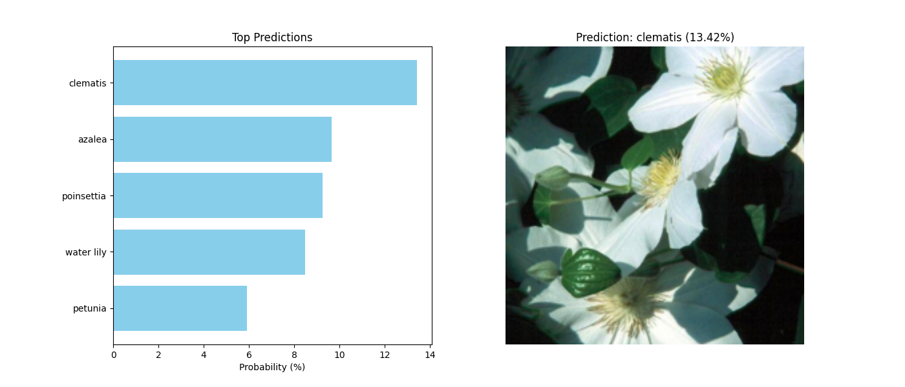
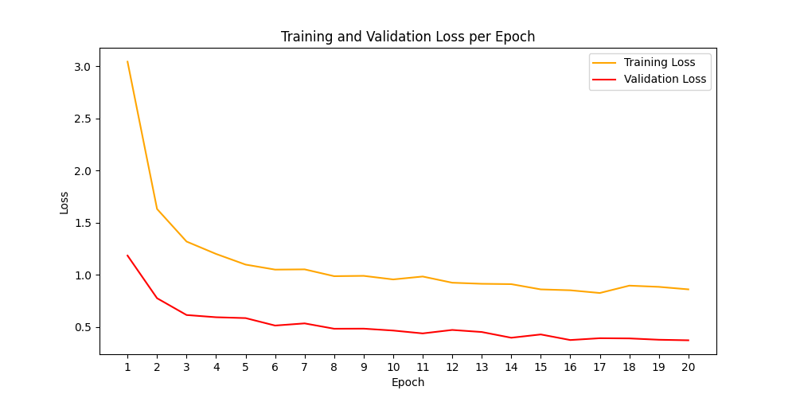
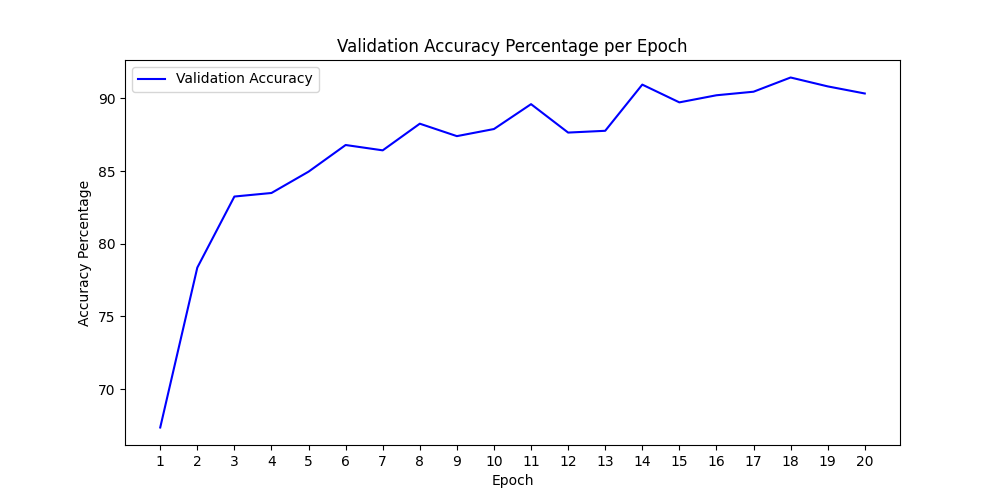
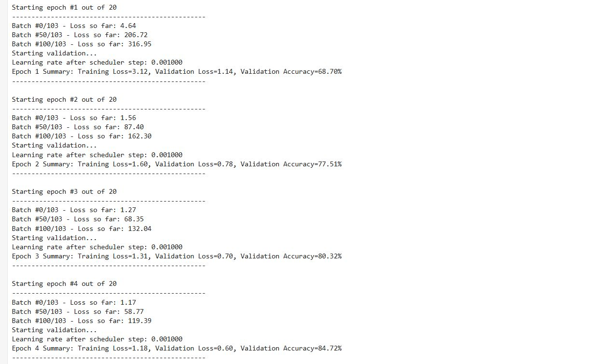
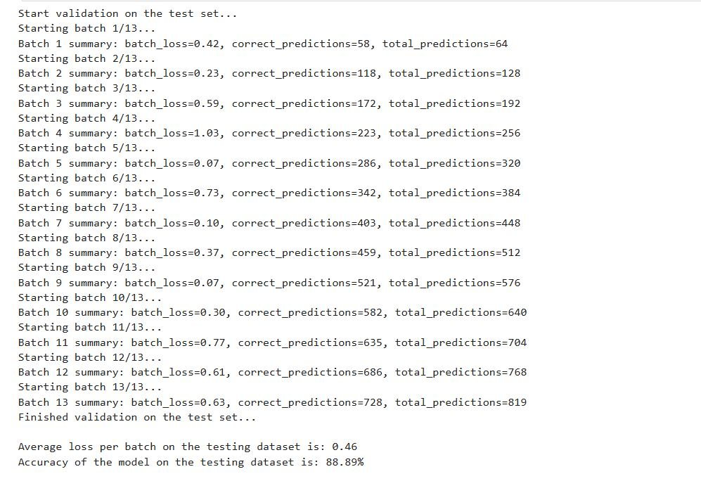

<!-- PROJECT SHIELDS -->
<!--
*** I'm using markdown "reference style" links for readability.
*** Reference links are enclosed in brackets [ ] instead of parentheses ( ).
*** See the bottom of this document for the declaration of the reference variables.
*** This is an optional, concise syntax you may use.
*** https://www.markdownguide.org/basic-syntax/#reference-style-links
-->

[![LinkedIn][linkedin-shield]][linkedin-url]

<!-- PROJECT LOGO -->
 

    

<h3 align="center">Flora Vision Image Classifier</h3>

<!-- TABLE OF CONTENTS -->

  
Table of Contents

  <ol>
    <li><a href="#about-the-project">About The Project</a></li>
    <li><a href="#main-features">Main Features</a></li>
    <li><a href="#built-with">Built With</a></li>
    <li><a href="#screenshots">Screenshots</a></li>
    <li><a href="#contact">Contact</a></li>
  </ol> 

<!-- ABOUT THE PROJECT -->

## About The Project

* **Project Name:** Flora Vision Image Classifier
* **Version:** v1.0.0
* **Purpose:** To classify images of flowers into their respective categories using a deep learning model.

### Description

Flora Vision Image Classifier is a deep learning-based project designed to identify and classify images of flowers.
Initially, the project was developed as a Jupyter Notebook for experimentation and analysis. Later, it was refactored
into a modularized command-line application for practical usage and easier deployment. Users can now train models,
validate performance, and make predictions directly from the command line by running the `train.py` and `predict.py`
scripts.

The application is configurable via a `config.yaml` file, which simplifies hyperparameter tuning and dataset management.

(<a href="#readme-top">back to top</a>)

## Main Features

- **Notebook to CLI Transformation:** Developed initially in a Jupyter Notebook and transformed into a fully modular
  command-line application.
- **Training Module:** Train the classifier using a pre-trained model with fine-tuned parameters.
- **Validation Module:** Validate the trained model to assess its performance and accuracy.
- **Testing Module:** Test the model on unseen images and measure its classification accuracy.
- **Prediction Module:** Predict the top flower categories for a given image.
- **Config-Driven Architecture:** Configurable hyperparameters like learning rate, batch size, and number of epochs
  via `config.yaml`.
- **Modular Design:** Organized into reusable modules and packages for scalability.

(<a href="#readme-top">back to top</a>)

## Built With

- **Python** - Programming Language
- **PyTorch** - Deep Learning Framework
- **TorchVision** - Utilities for Computer Vision
- **Matplotlib** - Visualization
- **Pillow** - Image Processing
- **JSON** - Category Mapping

(<a href="#readme-top">back to top</a>)

## Screenshots

### Training and Validation Losses Per Epoch

### Validation Accuracy Per Epoch

### Training in Progress

### Validation Results

### Top Predictions

(<a href="#readme-top">back to top</a>)

<!-- CONTACT -->

## Contact

Mohamed AbdelGawad Ibrahim - [@m-abdelgawad](https://www.linkedin.com/in/m-abdelgawad/) - <a href="tel:+201069052620">
+201069052620</a> - muhammadabdelgawwad@gmail.com

GitHub Profile Link: [https://github.com/m-abdelgawad](https://github.com/m-abdelgawad)

(<a href="#readme-top">back to top</a>)

<!-- MARKDOWN LINKS & IMAGES -->
<!-- https://www.markdownguide.org/basic-syntax/#reference-style-links -->

[linkedin-shield]: https://img.shields.io/badge/-LinkedIn-black.svg?style=for-the-badge&logo=linkedin&colorB=555

[linkedin-url]: https://www.linkedin.com/in/m-abdelgawad/
